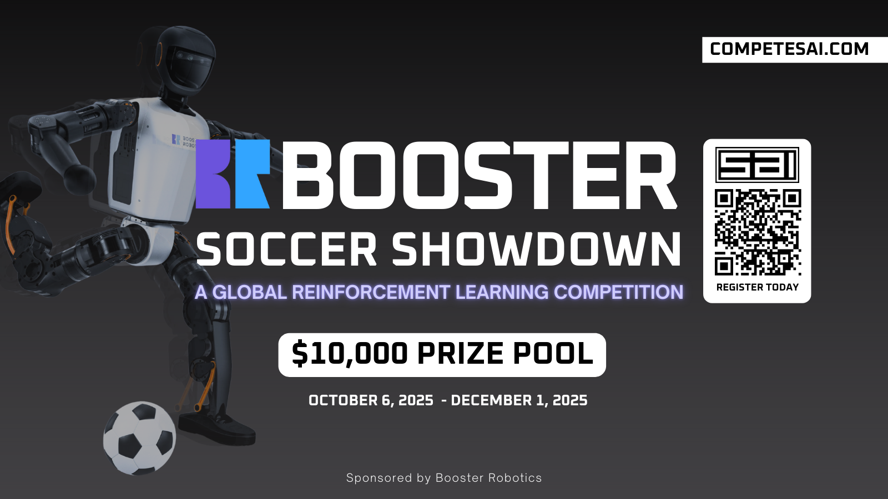

# BOOSTER SOCCER SHOWDOWN

  

A fast, extensible robotics soccer competition focused on **generalization across environments**. All the models and datasets are hosted on [Hugging Face](https://huggingface.co/SaiResearch) and the competition is live on [SAI](https://competesai.com/competitions/cmp_xnSCxcJXQclQ).

---

## Compatibility & Requirements

* **Python**: 3.10+
* **Pip**: compatible with environments using Python ≥ 3.10
* **OS**: macOS (Apple Silicon), Linux, and Windows

> Tip: Use a Python 3.10+ environment created via `pyenv`, `conda`, or `uv` for the smoothest experience.

---

## Installation

1. **Clone the repo**

```bash
git clone https://github.com/ArenaX-Labs/booster_soccer_showdown.git
cd booster_soccer_showdown
```

2. **Create & activate a Python 3.10+ environment**

```bash
# any env manager is fine; here are a few options
# --- venv ---
python3 -m venv .venv
source .venv/bin/activate  # Windows: .venv\Scripts\activate

# --- conda ---
# conda create -n booster-ssl python=3.11 -y && conda activate booster-ssl
```

3. **Install dependencies**

```bash
pip install -r requirements.txt
```

---

## Teleoperation

Booster Soccer Showdown supports keyboard teleop out of the box.

```bash
python booster_control/teleoperate.py \
  --env LowerT1GoaliePenaltyKick-v0 
```

**Default bindings (example):**

* `W/S`: move forward/backward
* `A/D`: move left/right
* `Q/E`: rotate left/right
* `L`: reset commands
* `P`: reset environment

---